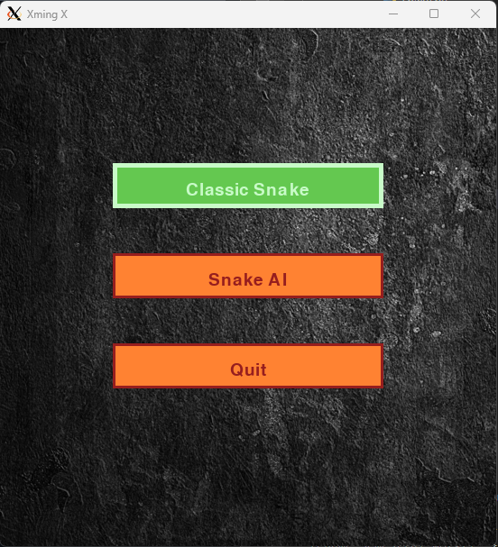
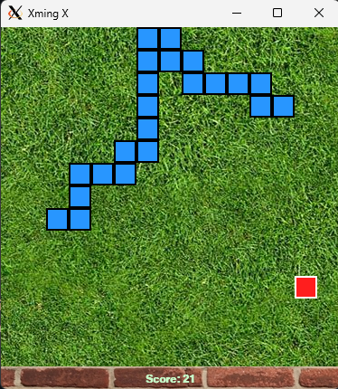

# BI-ZUM and BI-PYT Semestral work

This project is an implementation of the popular **Snake** game. The game is available in two modes:
**Classic Snake** (the user is playing using the keyboard and WASD or ARROWS keys) or **Snake AI**
(the implementation of the Snake Artificial Intelligence using the Genetic Algorithm and Neural Networks).

After some years, I'm wondering if this was the right combination of the AI algorithms. I'm basically training
some neural networks with genetic algorithm functions here (crossing and mutating the NNs, without backward propagation).

## Installation

The project uses two third-party libraries: **pygame** and **numpy**. To install them on your machine,
use the requirements file, or install in editable mode from the project directory:

`pip install -r requirements.txt`
`pip install -e .`

To use the DevContainer provided in this repo, you'll need to solve some problems that Pygame starts having
when Docker is involved. On Windows, I've installed XMing, so that my Windows display driver can be used.
Without that, the game window might not open at all in the container.

## Running

To run the application, execute this in the project directory:

`python src/main.py`

If editable install was done, you can also simply type:

`snake`

## Documentation

More documentation can be found in the task protocol file.
